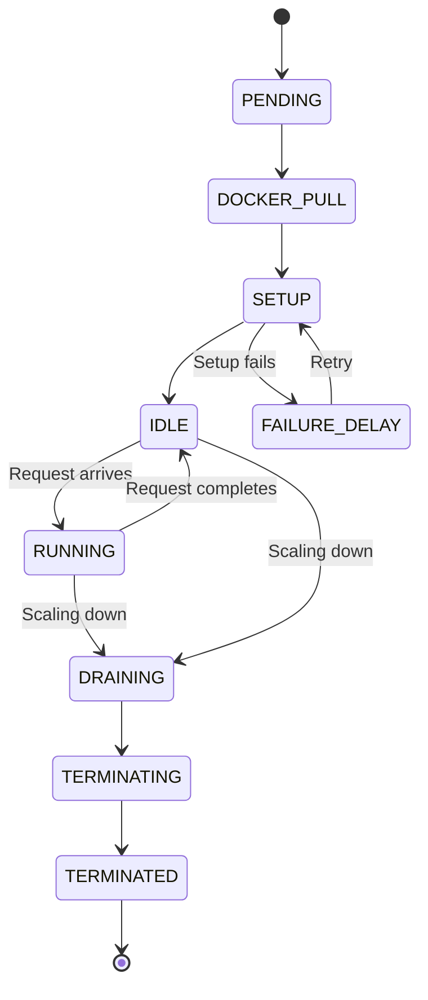

> ## Documentation Index
> Fetch the complete documentation index at: https://docs.fal.ai/llms.txt
> Use this file to discover all available pages before exploring further.

# Understanding Runners

> Learn about runner lifecycle, states, and how the caching system works in fal.

## What is a Runner?

A **runner** is a compute instance of your application running on fal's infrastructure. Each runner is tied to a specific machine type that determines its hardware resources (CPU cores, RAM, GPU type and count).

When you deploy an application, fal automatically creates and manages runners that:

* Run on your configured machine type (e.g., `GPU-H100`, `GPU-A100`)
* Can have 1-8 GPUs depending on your `num_gpus` configuration
* Load your model and dependencies during startup
* Serve requests from your users
* Scale up and down based on demand
* Share cached resources to improve performance

Each runner is an isolated environment with its own copy of your application code and loaded models.

**Machine type configuration example:**

```python  theme={null}
class MyApp(fal.App):
    machine_type = "GPU-H100"  # Specify GPU type
    num_gpus = 2                # Request 2 GPUs per runner
    # ...
```

For details on available machine types and how to choose the right one, see [Machine Types](/serverless/deployment-operations/machine-types). For multi-GPU workloads, see [Multi-GPU Workloads documentation](/serverless/distributed/overview).

## Runner Lifecycle and States

Runners transition through different states during their lifecycle. Understanding these states helps you monitor performance and debug issues.



### Runner States

| State              | Description                                                         |
| :----------------- | :------------------------------------------------------------------ |
| **PENDING**        | Runner is waiting to be scheduled on available hardware             |
| **DOCKER\_PULL**   | Pulling Docker images from registry (if using custom container)     |
| **SETUP**          | Running `setup()` method - loading model and initializing resources |
| **FAILURE\_DELAY** | Runner startup failed, waiting before retrying                      |
| **IDLE**           | Ready and waiting for work - no active requests                     |
| **RUNNING**        | Actively processing one or more requests                            |
| **DRAINING**       | Finishing current requests, won't accept new ones                   |
| **TERMINATING**    | Shutting down, running `teardown()` if defined                      |
| **TERMINATED**     | Runner has stopped and resources are released                       |

### State Transitions Explained

**Startup Flow** (`PENDING` → `DOCKER_PULL` → `SETUP` → `IDLE`):

1. When demand increases, fal schedules a new runner
2. If using a custom container, Docker images are pulled
3. Your `setup()` method runs to load models and initialize
4. Runner enters IDLE state, ready to serve requests

**Startup Failure** (`SETUP` → `FAILURE_DELAY` → `SETUP`):

If your `setup()` method raises an exception or the runner crashes during startup, the runner enters the `FAILURE_DELAY` state. In this state the runner is paused for a cooldown period before the system retries initialization. After the delay, the runner transitions back to `SETUP` and attempts startup again. This prevents a failing runner from consuming resources in a tight crash loop.

When you see runners in `FAILURE_DELAY`, check your `setup()` method and runner logs for errors. Common causes include missing model files, out-of-memory errors during model loading, and dependency issues.

**Request Processing** (`IDLE` ↔ `RUNNING`):

* When a request arrives, an IDLE runner transitions to RUNNING
* After completing all requests, it returns to IDLE
* Runners can handle multiple concurrent requests if `max_multiplexing > 1`

**Shutdown Flow** (`DRAINING` → `TERMINATING` → `TERMINATED`):

1. When scaling down or reaching expiration, runners enter DRAINING
2. No new requests are routed, but existing requests continue
3. After requests complete (or timeout), runner enters TERMINATING
4. Your `teardown()` method runs for cleanup
5. Runner is terminated and resources are freed

## How Caching Works in fal

fal uses a sophisticated multi-layer caching system to reduce cold start times as your application serves traffic.

### Multi-Layer Cache Architecture

fal's caching system has three layers, each with different performance characteristics:

| Cache Layer           | Speed    | Scope                  | Use Case                  |
| :-------------------- | :------- | :--------------------- | :------------------------ |
| **Local Node Cache**  | Fastest  | Same physical machine  | Runners on same node      |
| **Distributed Cache** | Fast     | Same datacenter/region | Runners across nodes      |
| **Object Store**      | Moderate | Global                 | Fallback for cache misses |

When a runner needs a file (model weights, Docker layers, etc.):

1. Check local node cache first (fastest)
2. If not found, check distributed datacenter cache
3. If not found, fetch from object store and populate caches

### What Gets Cached

**Docker Image Layers:**

* Container images are split into layers
* Each layer is cached independently
* Shared layers across images are reused

**Model Weights:**

* Files downloaded to `/data` are automatically cached
* HuggingFace models cached at `/data/.cache/huggingface`
* Custom weights you download are cached

**Compiled Model Caches:**

* PyTorch Inductor compiled models
* TensorRT engines
* Other JIT compilation artifacts

See [Use Persistent Storage](/serverless/development/use-persistent-storage) for details on the `/data` caching system.

### Cache Warming with Traffic

As your application serves requests, caches automatically warm up:

1. **First runner**: Downloads everything from object store, populates local cache
2. **Same node runners**: Benefit from local cache
3. **Other node runners**: Benefit from distributed cache
4. **Over time**: More nodes have cached data, cold starts get faster

This cache warming effect is why production performance improves significantly over time.

## Monitoring Runner States

Understanding your runner states helps optimize performance and debug issues.

### CLI Commands

```bash  theme={null}
# List all runners with their current states
fal runners list

# Filter by specific state
fal runners list --state idle
fal runners list --state running
fal runners list --state pending
fal runners list --state failure_delay

# View runner history (up to 24 hours)
fal runners list --since "1h"
fal runners list --since "2024-01-15T10:00:00Z"

# Get detailed information about a specific runner
fal runners get <runner-id>
```

See [`fal runners` CLI reference](/serverless/python/cli#runners) for all available commands.

### Dashboard Metrics

The [fal dashboard](https://fal.ai/dashboard) provides visual monitoring:

* **Runner state timeline**: See state transitions over time
* **State duration breakdown**: Understand where time is spent (PENDING, SETUP, RUNNING)
* **Active runners**: Monitor current runner count and states
* **Cold start metrics**: Track setup duration and cache effectiveness

## Best Practices

### Optimize Startup Performance

* **Minimize image size**: Use smaller base images, multi-stage builds
* **Lazy loading**: Load only what you need in `setup()`
* **Use persistent storage**: Download models to `/data` for caching
* **Compiled caches**: Share compilation artifacts across runners

### Maintain Warm Runners

* **Set appropriate `keep_alive`**: Balance cost vs latency based on your traffic patterns
* **Use `min_concurrency`**: Keep minimum runners warm for predictable latency
* **Monitor IDLE runners**: Understand how many runners are waiting vs actively serving

### Monitor and Debug

* **Track state durations**: Identify bottlenecks in startup sequence
* **Watch PENDING times**: High PENDING times indicate capacity constraints
* **Monitor IDLE → RUNNING**: Understand warm start utilization
* **Investigate FAILURE\_DELAY runners**: Runners stuck in this state indicate startup errors — check `setup()` logic and runner logs
* **Review TERMINATED runners**: Debug failures using `--since` flag

### Scale Effectively

* **Start conservative**: Begin with `min_concurrency = 0` or `1`
* **Monitor and adjust**: Use dashboard metrics to tune scaling parameters
* **Plan for traffic spikes**: Use `concurrency_buffer` for headroom
* **Test production patterns**: Simulate realistic traffic during testing

## Related Resources

* [Optimizing Cold Starts](/serverless/deployment-operations/optimize-cold-starts) - Strategies to reduce cold start times
* [Scale Your Application](/serverless/deployment-operations/scale-your-application) - Detailed scaling configuration
* [Monitor Performance](/serverless/deployment-operations/monitor-performance) - Performance monitoring and metrics
* [Use Persistent Storage](/serverless/development/use-persistent-storage) - Details on the `/data` caching system
* [Optimize Startup with Compiled Caches](/serverless/optimizations/optimize-startup-with-compiled-caches) - Share compilation artifacts
* [Core Concepts](/serverless/getting-started/core-concepts) - Learn about `setup()` and `teardown()` lifecycle methods
